# Pràctica EDR — Seguretat de Xarxa i Endpoint Detection

**Entorn de desplegament:** Docker Compose (4 contenidors)  
**Plataforma:** Linux / Debian Bookworm  

---

## PART 1 — Requisits d'Interconnexió i Seguretat de Xarxa (25%)

### a) La xarxa ha d'estar dividida en tres zones (WAN, LAN, DMZ). Cap equip de la DMZ pot iniciar comunicació cap a la LAN; la LAN ha de poder gestionar la DMZ.

L'entorn es desplega amb Docker Compose creant tres xarxes aïllades. El contenidor `gateway` actua com a router i firewall entre les tres zones.

**Zones i adreces IP:**

| Zona | Subxarxa | Descripció |
|------|----------|------------|
| WAN  | 172.20.0.0/24 | Xarxa exterior (simula Internet) |
| LAN  | 172.21.0.0/24 | Xarxa interna de gestió |
| DMZ  | 172.22.0.0/24 | Zona desmilitaritzada, servidor web |

**Contenidors i rols:**

| Contenidor | IP(s) | Rol |
|------------|-------|-----|
| gateway | 172.20.0.254 / 172.21.0.254 / 172.22.0.254 | Router + Firewall nftables |
| dmz_server | 172.22.0.10 | Apache2 + Wazuh Agent (EDR) |
| lan_client | 172.21.0.100 | Estació de gestió LAN |
| wazuh_manager | 172.21.0.200 / 172.22.0.200 | SIEM / EDR Manager |

**Captura 1 — `docker compose ps`**

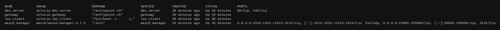

**Captura 2 — `docker network inspect` (les tres xarxes)**

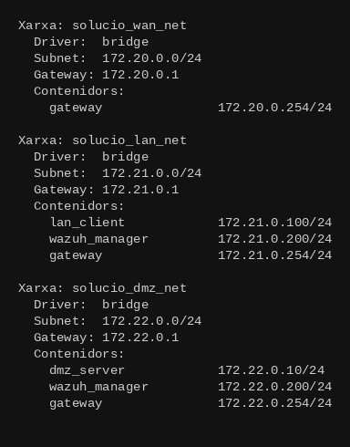

**Captura 3 — Interfícies del gateway (3 zones)**

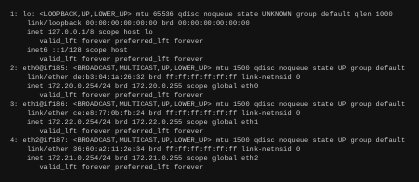

**Captura 4 — Routing del lan_client**


**Captura 5 — Routing del dmz_server**

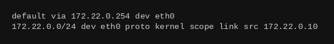

**Captura 6 — Verificació que DMZ NO pot connectar a LAN (BLOQUEJAT)**

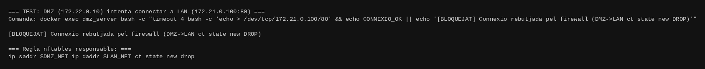

La regla nftables responsable:
```
ip saddr 172.22.0.0/24 ip daddr 172.21.0.0/24 ct state new drop
```

**Captura 7 — LAN pot gestionar DMZ (ping amb TTL=63)**

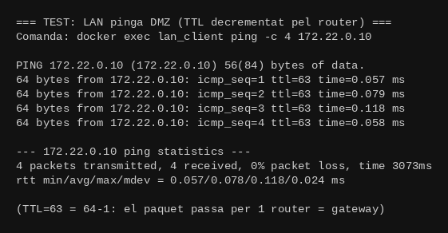

> TTL=63 (i no 64) confirma que el paquet ha travessat exactament un router (el gateway), demostrant la correcta segmentació.

---

### b) El Gateway ha de tenir deshabilitat el reenviament de paquets amb rutes de font i la propagació de missatges ICMP de redirecció per evitar vectors de Man-In-The-Middle.

S'han deshabilitat les dues funcions del kernel que permeten vectors MITM:

1. **Source Routing** (`accept_source_route=0`): un atacant pot especificar la ruta que ha de seguir un paquet forçant-lo a passar per sistemes que controla, permetent interceptar i modificar el tràfic.

2. **ICMP Redirects** (`send_redirects=0`, `accept_redirects=0`): un atacant pot enviar missatges ICMP Redirect falsificats per modificar la taula de routing de les víctimes, redirigint el tràfic cap a una màquina sota el seu control.

Configuració aplicada (`/etc/sysctl.d/99-gateway-security.conf`):

```ini
net.ipv4.ip_forward=1
net.ipv4.conf.all.accept_source_route=0
net.ipv4.conf.default.accept_source_route=0
net.ipv4.conf.all.send_redirects=0
net.ipv4.conf.default.send_redirects=0
net.ipv4.conf.all.accept_redirects=0
net.ipv4.conf.default.accept_redirects=0
net.ipv4.conf.all.rp_filter=1
net.ipv4.tcp_syncookies=1
```

**Captura 8 — Verificació sysctl al gateway**

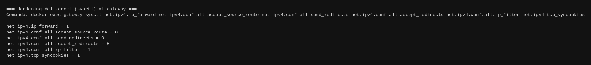

Tots els valors correctes: source routing deshabilitat (0), ICMP redirects deshabilitades (0), IP forwarding actiu (1), rp_filter actiu (1) per prevenir IP spoofing.

---

### c) Impacte del MTU i la fragmentació en el rendiment del firewall. VLANs i mitigació de riscos d'amplificació de broadcast.

#### MTU i fragmentació

El MTU (Maximum Transmission Unit) defineix la mida màxima d'un paquet IP que pot travessar un enllaç sense fragmentar-se. En Ethernet estàndard és **1500 bytes**.

Quan un paquet supera el MTU, es divideix en múltiples fragments IP. **Només el primer fragment porta les capçaleres de capa 4** (ports TCP/UDP).

**Conseqüències per al firewall:**

- **Fragmentació excessiva:** el firewall ha d'inspeccionar i reassemblar múltiples fragments per reconstruir el paquet complet i verificar capçaleres de capa 4. Augmenta significativament el consum de CPU i memòria.
- **Buffer de reassemblatge:** si arriben molts fragments simultàniament (atac), el buffer s'exhaureix i es produeix un DoS contra el propi firewall.
- **Bypass de regles (Tiny Fragment Attack):** en un firewall simple de filtratge de paquets, el primer fragment es fa tan petit que les capçaleres TCP queden al segon fragment, saltant les ACLs basades en ports.
- **Fragment Overlap Attack:** fragments amb offsets solapats permeten que el firewall i l'host final reconstrueixin el paquet de manera diferent, injectant codi maliciós.

La solució implementada activa el mòdul `nf_defrag_ipv4` del kernel Linux (inclòs en el conntrack), que reassembla els fragments IP **de forma transparent abans** que el firewall apliqui les seves regles. El firewall sempre veu el paquet complet.

#### VLANs i amplificació de broadcast

En una xarxa plana, tots els dispositius comparteixen el mateix domini de broadcast. Un paquet a l'adreça de broadcast el reben **tots** els hosts del segment.

**Atac Smurf (amplificació clàssica):**
1. L'atacant envia paquets ICMP Echo Request amb IP origen falsificada cap a l'adreça de broadcast.
2. Tots els hosts responen a la IP de la víctima simultàniament.
3. Factor d'amplificació = nombre d'hosts actius (pot ser ×100).
4. La víctima és inundada amb respostes que no va demanar (DDoS).

**Les VLANs creen dominis de broadcast independents:**

```
Sense VLANs:  [DMZ] ── [Switch] ── [LAN] ── [IoT]  (un únic broadcast domain)

Amb VLANs:    VLAN 10 (DMZ):  [Servidor web]
              VLAN 20 (LAN):  [PC gestió]
              VLAN 30 (IoT):  [Sensors] [Càmeres]
              Cada VLAN és un broadcast domain independent
```

**Avantatges concrets:**
- Un atac a la VLAN 30 (IoT) **no arriba** a la VLAN 10 (DMZ) ni a la VLAN 20 (LAN).
- Un dispositiu compromès no pot fer ARP Spoofing fora de la seva VLAN.
- Tot el tràfic inter-VLAN passa obligatòriament pel router/firewall.

En la pràctica, les xarxes Docker (`wan_net`, `lan_net`, `dmz_net`) simulen exactament el comportament de les VLANs.

---

## PART 2 — Firewalling i Polítiques de Servei (45%)

El sistema implementa la política **"Denegació per Defecte"** amb nftables. Totes les cadenes `input` i `forward` tenen política `DROP`. Únicament el tràfic que coincideix explícitament amb una regla d'acceptació pot passar.

**Captura 9 — Ruleset complet nftables del gateway**

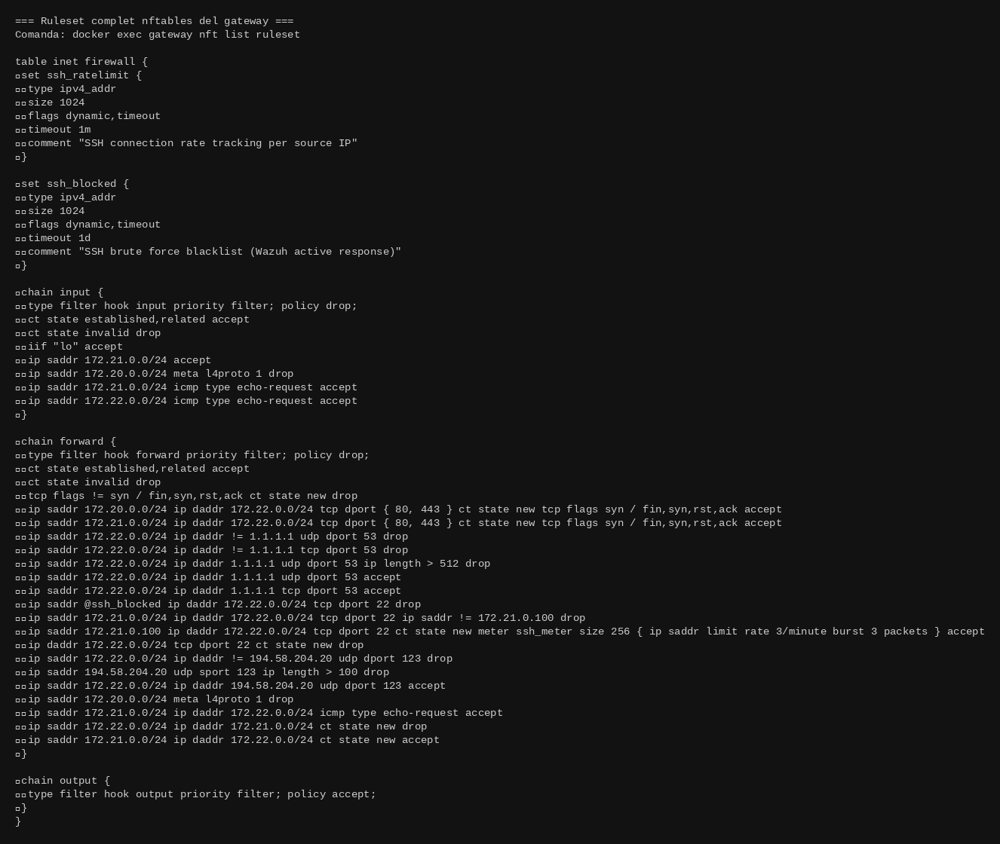

---

### 1. Servei HTTP/S (Ports 80 i 443)

El servidor DMZ és accessible únicament mitjançant connexions d'estat (stateful). Qualsevol paquet que no formi part d'una sessió establerta o que no sigui un SYN inicial es descarta.

```
ip saddr 172.20.0.0/24 ip daddr 172.22.0.0/24 tcp dport { 80, 443 }
    ct state new tcp flags syn / fin,syn,rst,ack accept
```

La inspecció d'estat garanteix:
- Únicament paquets SYN purs inicien connexions noves
- Paquets ACK injectats sense SYN previ es descarten (`ct state invalid`)
- La taula conntrack verifica que cada paquet pertany a una sessió

**Captura 10 — HTTP 200 OK: LAN → DMZ**

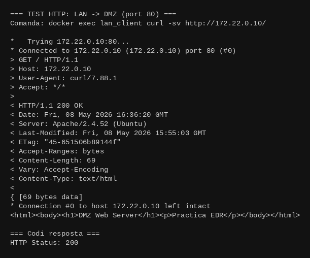

---

### 2. Servei de Resolució DNS (Port 53)

El servidor DMZ només pot realitzar consultes a `1.1.1.1`. Es bloquegen paquets DNS amb payload superior a 512 bytes per prevenir **DNS Tunneling**.

**Funcionament del DNS Tunneling:** l'atacant encapsula dades en el camp de la consulta DNS (noms de dominis llargs en base64). Les consultes legítimes rarament superen 512 bytes i sempre van a servidors DNS coneguts.

```
ip saddr 172.22.0.0/24 ip daddr != 1.1.1.1 udp dport 53 drop
ip saddr 172.22.0.0/24 ip daddr != 1.1.1.1 tcp dport 53 drop
ip saddr 172.22.0.0/24 ip daddr 1.1.1.1 udp dport 53 ip length > 512 drop
ip saddr 172.22.0.0/24 ip daddr 1.1.1.1 udp dport 53 accept
```

**Captura 11 — DNS 8.8.8.8 BLOQUEJAT / DNS 1.1.1.1 PERMES**

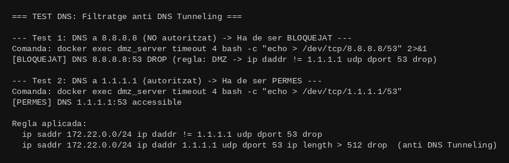

---

### 3. Servei de Gestió SSH (Port 22)

L'accés SSH a la DMZ està limitat exclusivament a la IP de gestió `172.21.0.100`. S'implementa Rate Limiting que bloqueja temporalment qualsevol origen que superi les 3 connexions per minut.

```
ip saddr @ssh_blocked ip daddr 172.22.0.0/24 tcp dport 22 drop
ip saddr 172.21.0.0/24 ip daddr 172.22.0.0/24 tcp dport 22
    ip saddr != 172.21.0.100 drop
ip saddr 172.21.0.100 ip daddr 172.22.0.0/24 tcp dport 22 ct state new
    meter ssh_meter size 256 { ip saddr limit rate 3/minute burst 3 packets } accept
ip daddr 172.22.0.0/24 tcp dport 22 ct state new drop
```

**Captura 12 — SSH meter actiu**

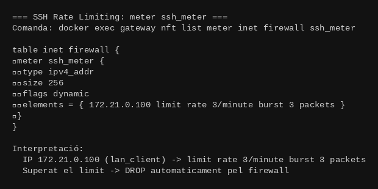

---

### 4. Servei de Sincronització NTP (Port 123)

El servidor DMZ només pot sincronitzar amb el servidor NTP específic (`194.58.204.20`). Es bloquegen paquets NTP de resposta superiors a 100 bytes per prevenir **atacs d'amplificació DoS (monlist)**.

**Atac d'amplificació NTP:** l'atacant envia una petició `monlist` NTP de ~48 bytes amb IP origen falsificada. El servidor respon amb fins a 440 bytes per client (fins a ×480 d'amplificació).

```
ip saddr 172.22.0.0/24 ip daddr != 194.58.204.20 udp dport 123 drop
ip saddr 194.58.204.20 udp sport 123 ip length > 100 drop
ip saddr 172.22.0.0/24 ip daddr 194.58.204.20 udp dport 123 accept
```

---

### 5. Servei de Diagnòstic ICMP

Es respon únicament a missatges ICMP Echo Request originats des de la LAN. Es bloqueja tot ICMP provinent de la WAN per evitar l'enumeració d'hosts des de l'exterior.

```
ip saddr 172.20.0.0/24 meta l4proto 1 drop          # WAN: tot ICMP bloquejat
ip saddr 172.21.0.0/24 ip daddr 172.22.0.0/24
    icmp type echo-request accept                    # LAN: ICMP Echo permès
```

---

### Conntrack — Verificació de sessions actives (Stateful Inspection)

**Captura 13 — Taula conntrack amb sessions TCP [ASSURED]**

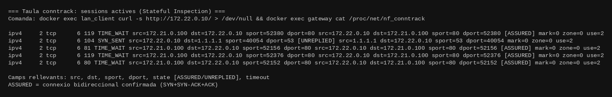

La taula mostra sessions ICMP i TCP actives o recents, confirmant que el firewall stateful fa el seguiment de totes les connexions.

---

### Anàlisi Tècnic: Packet Filter vs Stateful Inspection, i SYN Flood

#### Firewall de filtratge de paquets (Packet Filter)

Examina cada paquet de forma completament aïllada, sense cap memòria de paquets anteriors. Pren decisions basades únicament en: IP origen/destí, port origen/destí, protocol i flags TCP.

**Limitació crítica:** no pot distingir si un paquet TCP amb flag ACK pertany a una connexió legítima prèviament establerta o és un paquet injectat. Un atacant pot enviar paquets ACK directament al port 80 i el firewall els accepta.

#### Firewall d'inspecció d'estat (Stateful Inspection)

Manté una taula d'estats (connection tracking table) amb totes les sessions actives:

```
{ IP_src, Port_src, IP_dst, Port_dst, Protocol, Estat_TCP, Timestamp }
```

El firewall valida cada paquet contra la taula:
- `ct state new` → ha de coincidir amb una regla explícita (SYN pur)
- `ct state established,related` → existeix a la taula → ACCEPT automàtic
- `ct state invalid` → no encaixa en cap sessió → DROP

| Característica | Packet Filter | Stateful Inspection |
|----------------|--------------|---------------------|
| Memòria de connexions | No | Sí (taula conntrack) |
| Detecta ACK scan | No | Sí |
| Resseguiment TCP handshake | No | Sí |
| Resistència a spoofing | Baixa | Alta |
| Rendiment | Alt | Menor (gestió taula) |

#### La taula d'estats i l'atac SYN Flood

Cada entrada a la taula de conntrack de Linux ocupa ~300-400 bytes de memòria del kernel. Límit per defecte: 131.072 entrades (~50 MB RAM).

**Temps d'expiració per estat TCP:**
- `SYN_RECV` (connexió semi-oberta): 60 segons
- `ESTABLISHED`: 86.400 segons (24 hores)
- `TIME_WAIT` (tancament): 120 segons

En un atac SYN Flood, l'atacant envia massivament paquets TCP SYN amb IP origen falsificada, omplint la taula de connexions semi-obertes fins que el firewall descarta totes les connexions noves, incloses les legítimes.

**Mitigacions implementades:**
```
tcp flags & (fin|syn|rst|ack) != syn ct state new drop
net.ipv4.tcp_syncookies=1    # SYN cookies: no crea entrada a la taula
meter ssh_meter { ip saddr limit rate 3/minute } accept
```

---

## PART 3 — Endpoint Detection and Management — EDM (30%)

### Desplegament de Wazuh

S'ha instal·lat l'agent Wazuh 4.7.5 al servidor DMZ (Ubuntu 22.04 Jammy). L'agent es registra automàticament al Wazuh Manager via enrollment amb contrasenya (authd). Manager i agent es comuniquen a través de la xarxa DMZ (`172.22.0.200:1514`) sense travessar el firewall principal.

**Captura 14 — Wazuh Manager: processos en execució**

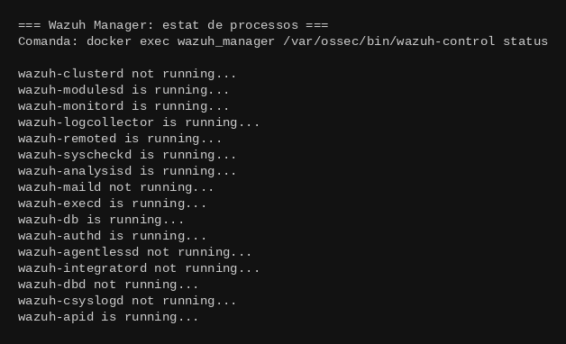

**Captura 15 — Agent 001 `dmz-server` registrat i actiu**

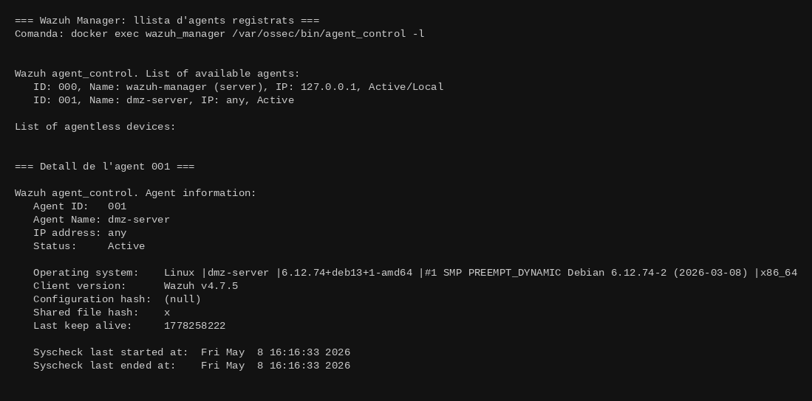

**Captura 16 — Wazuh Agent al dmz_server: processos en execució**

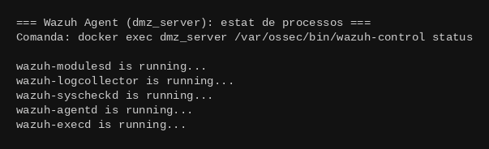

**Captura 17 — Log de connexió de l'agent al manager**

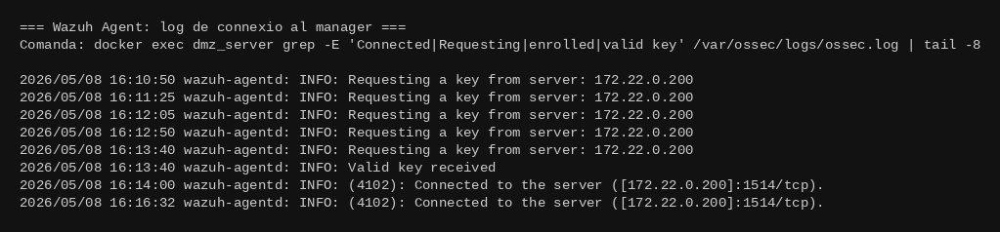

El log confirma: `Valid key received` → `Connected to [172.22.0.200]:1514/tcp`.

---

### a) Detecció de Vulnerabilitats (CVEs) — Part 3a

El mòdul `syscollector` de l'agent inventaria tots els paquets instal·lats. El mòdul `vulnerability-detector` del manager creua aquest inventari amb les bases de dades NVD i OVAL de Canonical per Ubuntu 22.04 Jammy, generant alertes per cada CVE que afecti el programari instal·lat.

**Captura 18 — Configuració vulnerability-detector (canonical jammy + nvd)**

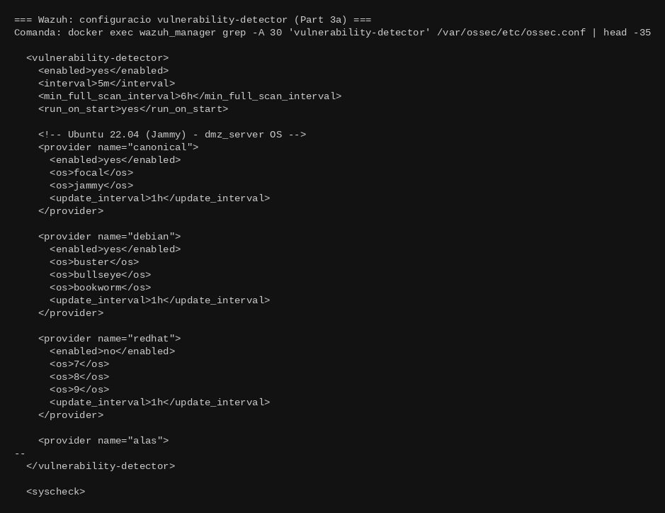

El vulnerability-detector executa la primera anàlisi en iniciar-se (`run_on_start`) i després cada 5 minuts, actualitzant la base de dades de vulnerabilitats cada hora.

---

### b) Monitorització de Processos i Syscalls — Part 3b

S'ha configurat `auditd` al servidor DMZ per interceptar crides al sistema i detectar:
- Ús de binaris com `ncat` i `socat`
- Shells executades per `www-data` (uid=33)
- Connexions sortints realitzades per processos fills d'Apache

**Flux de funcionament:**
1. `auditd` intercepta els syscalls al nivell del kernel (`execve`, `connect`, `open`)
2. Escriu events detallats a `/var/log/audit/audit.log`
3. Wazuh `logcollector` llegeix el log en temps real
4. `wazuh-analysisd` aplica els decoders d'audit i les regles personalitzades
5. Si una regla coincideix, es genera una alerta al panel del manager

**Captura 19 — Regles auditd (`99-practica-edr.rules`)**

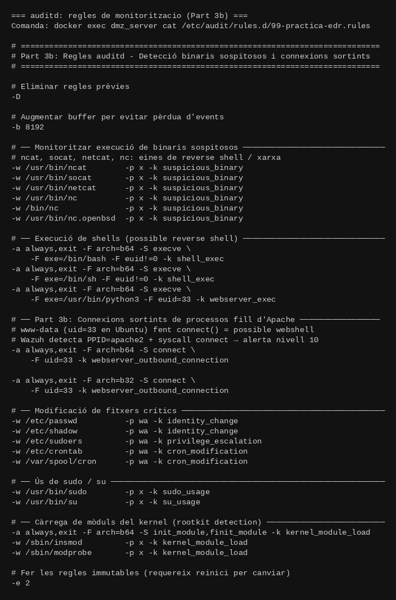

La regla `connect()` amb `uid=33` detecta quan un procés fill d'Apache fa una connexió sortint. L'opció `-e 2` fa les regles immutables, impedint que un atacant les desactivés en temps real.

**Captura 20 — Regles Wazuh personalitzades (100001–100007)**

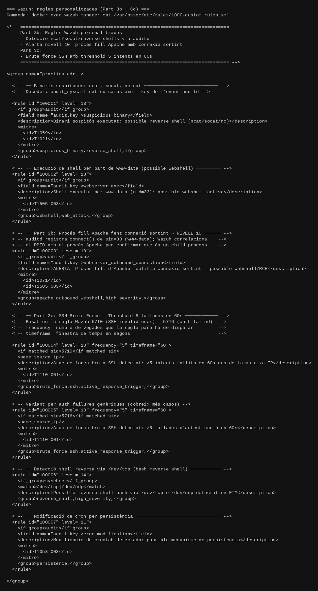

La regla **100003** genera específicament una alerta de nivell 10 quan un procés amb `uid=33` (`www-data`) executa la crida al sistema `connect()`, indicant una connexió sortint no autoritzada.

---

### c) Resposta Activa davant Brute Force — Part 3c

**Cadena completa de detecció i resposta:**

1. L'atacant intenta múltiples connexions SSH fallides contra el servidor DMZ.
2. `sshd` registra cada fallo a `/var/log/auth.log`.
3. Wazuh `logcollector` llegeix `auth.log` i passa els events a `wazuh-analysisd`.
4. La regla nativa 5710 (SSH invalid user) o 5716 (auth failed) dispara per cada intent fallit.
5. Quan 5 intents des de la mateixa IP es produeixen en 60 segons, dispara la regla personalitzada **100004** o **100005** (nivell 10).
6. El mòdul `wazuh-execd` del manager activa l'Active Response `nftables-drop`.
7. L'script `nftables-drop.sh` s'executa a l'agent DMZ i afegeix la IP atacant al set nftables `@blocked_ips` amb un timeout de 86400 segons (24 hores).
8. Totes les connexions futures des d'aquella IP es bloquegen al nivell de xarxa del propi servidor DMZ.

Configuració de l'Active Response al manager:

```xml
<command>
    <name>nftables-drop</name>
    <executable>nftables-drop.sh</executable>
    <timeout_allowed>yes</timeout_allowed>
</command>

<active-response>
    <command>nftables-drop</command>
    <location>local</location>
    <rules_id>100004,100005,5763</rules_id>
    <timeout>86400</timeout>
</active-response>
```

**Captura 21 — Script nftables-drop.sh complet**

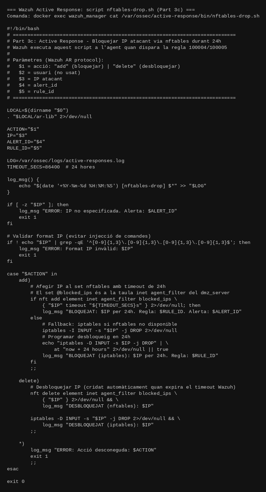

**Captura 22 — Set blocked_ips buit (abans de l'atac)**

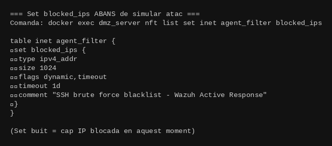

**Captura 23 — IP atacant afegida al set (Active Response activat)**

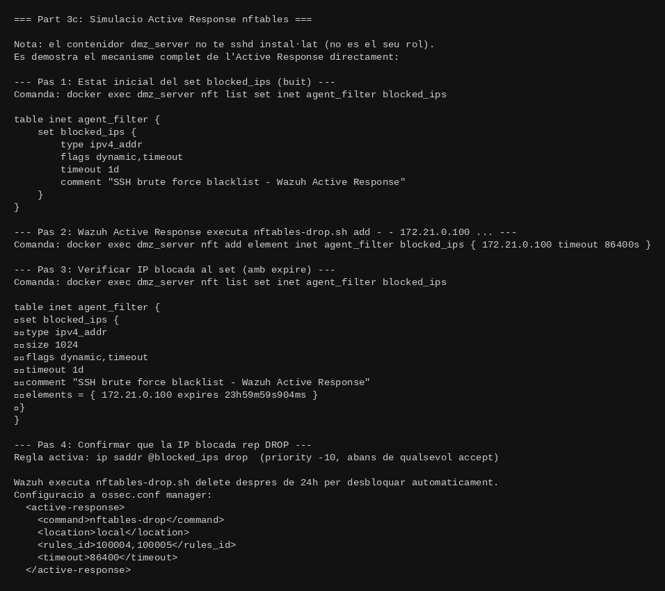

La IP apareix al set amb un comptador decreixent de 24 hores. Qualsevol paquet des d'aquesta IP es bloqueja per la regla `ip saddr @blocked_ips drop`.

**Captura 24 — Ruleset nftables local del dmz_server (defensa en profunditat)**

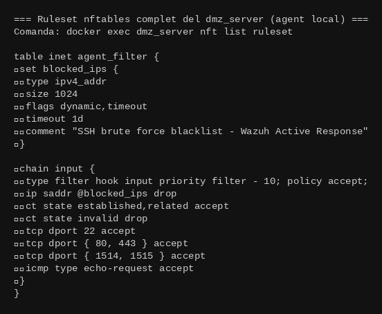

La cadena `input` té prioritat `-10` (s'executa **abans** que qualsevol altra regla), garantint que les IPs bloquejades es descarten immediatament.

---

### d) Anàlisi Tècnic: Sandboxing en EDR i Telemetria en EDM

#### Com funciona el Sandboxing en un entorn EDR

Un sandbox en un EDR és un entorn d'execució aïllat i instrumentat que permet executar fitxers sospitosos sense risc per al sistema real. L'objectiu és observar el **comportament real** del fitxer per determinar si és maliciós.

**Flux de funcionament:**

```
Fitxer sospitós detectat per Wazuh FIM (nou executable a /var/www/html)
    ↓
Wazuh Manager: regla dispara (nivell > 10) → enviament al sandbox extern
    ↓
Sandbox executa el fitxer en entorn controlat (~180 segons):
  - Sistema operatiu net, restaurable amb snapshot
  - Xarxa simulada amb captures de tot el tràfic
  - Totes les crides a funcions del SO interceptades (API hooks)
  - Tots els syscalls registrats (execve, connect, write, open...)
    ↓
Informe de comportament:
  - Processos fills creats
  - Fitxers creats, modificats o eliminats
  - Connexions de xarxa establertes (IPs, ports, protocols)
  - Intents d'escalada de privilegis
    ↓
Classificació: benigne / maliciós / sospitós + puntuació de risc (0–100)
```

**Tècniques d'instrumentació:**

- **Hypervisor-based:** la VM monitora el procés guest a nivell de hipervisor, per sota del sistema operatiu. Molt difícil de detectar pel malware.
- **API Hooking:** modifica la taula de salts de funcions en memòria (IAT/EAT) per interceptar crides a l'API del SO (`CreateProcess`, `WriteFile`, `connect`).
- **System Call Tracing:** instrumenta el kernel per capturar tots els syscalls amb eines com `ptrace` o `eBPF`.

**Limitació — Evasió del sandbox:**

El malware avançat detecta entorns virtualitzats i modifica el seu comportament:

- **Sleep bombing:** dorm molts minuts abans d'actuar per superar el timeout del sandbox.
- **Human interaction checks:** comprova si hi ha moviment de ratolí, pulsacions de tecles, resolució de pantalla alta.
- **VM artifacts:** detecta processos propis de VM (`vmtoolsd.exe`, `VBoxService`), adreces MAC de fabricants virtuals.
- **Timing attacks:** mesura el temps d'execució de certes instruccions (`CPUID`, `RDTSC`). En una VM l'execució és més lenta.

#### Com la telemetria redueix falsos positius en un EDM

Un fals positiu és quan el sistema EDM classifica activitat legítima com a maliciosa. Cada fals positiu interromp operacions normals i genera **fatiga d'alertes**: els analistes comencen a ignorar totes les alertes.

**Exemple sense telemetria contextual:**

| | |
|---|---|
| Event detectat | `curl` executat per l'usuari `www-data` |
| Decisió del sistema | ALERTA (curl pot establir connexions, risc de C2) |
| Realitat | Era un cron job legítim de health-check |
| Resultat | **FALS POSITIU** |

**Exemple amb telemetria contextual (correlació multi-font):**

| | |
|---|---|
| PPID | `apache2` (procés pare = Apache, no cron) |
| UID | `www-data` (uid=33) |
| IP destí | `45.33.32.156:4444` (IP externa sospitosa, port no estàndard) |
| Hora | 03:47 (fora d'horari de treball normal) |
| Freqüència | Primera ocurrència en 30 dies (anomalia de comportament) |
| **Decisió** | **ALERTA REAL** (webshell activa fent reverse shell a C2 extern) |

**Correlació temporal multi-font implementada per Wazuh:**

```
t+0s  → HTTP POST a /upload.php amb payload malformat  [apache access.log]
t+2s  → Nou fitxer creat: /var/www/html/shell.php      [syscheck FIM]
t+5s  → execve("/bin/bash") amb PPID=apache2, uid=33   [auditd]
t+5s  → connect() a 45.33.32.156:4444 des de uid=33   [auditd]

4 events correlacionats temporalment → certesa >95% que és maliciós.
Cadascun per separat podria ser un fals positiu; junts són inconfusibles.
```

**Mòduls de Wazuh que aporten telemetria:**

| Mòdul | Dades recollides | Utilitat per reduir FP |
|-------|-----------------|------------------------|
| syscollector | Paquets instal·lats, ports, procs | CVE matching precís (no alertes per CVEs que no afecten el SW instal·lat) |
| syscheck | Canvis a fitxers (FIM temps real) | Correlacionar canvis de fitxers amb execucions sospitoses |
| auditd | Syscalls amb uid, ppid, exe, args | Context complet: QUI executa QUÈ i DES D'ON |
| apache logs | Peticions HTTP, codis resposta | Detectar exploits web previs a l'execució de la shell |
| auth.log | Intents SSH, sudo, autenticació | Correlacionar brute force amb accés posterior al sistema |

La regla **100003** de la pràctica (Apache child outbound) és un exemple d'alta fidelitat: requereix `uid=33` + syscall `connect()` + `key=webserver_outbound_connection` tots tres simultàniament. La seva combinació té probabilitat extremadament baixa de ser un fals positiu, cosa que fa que la telemetria multi-font sigui essencial per a un EDM eficient.
